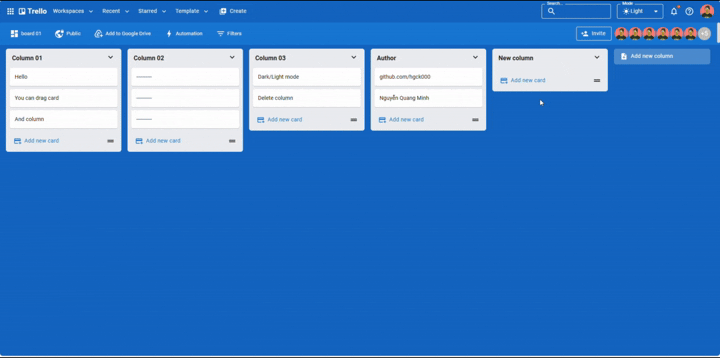

# Trello Web (Frontend)
A Trello-like React + Material UI app with buttery drag-and-drop for columns & cards, dark/light mode, CRUD, and responsive design. Built with Vite and deploys to Vercel.

## Features
- Drag & Drop columns & cards.
- Dark / Light theme with system preference & persistence.
- Create / rename / delete boards, columns, cards (with confirm dialogs).
- Responsive layout (desktop → mobile).

## Tech
- **React + Material UI + Vite**
- **@dnd-kit** (drag & drop)
- **Axios** (HTTP client)
- **ESLint** (linting)
- Deploy: **Vercel**

**Live:** https://trello-web-bay.vercel.app/

## Preview

Here’s a quick look at the UI:



## Quick Start

```bash
# 1) Require: Node.js >= 18

# 2) Active Yarn (if yarn is not available)
corepack enable
corepack prepare yarn@stable --activate

# 3) Install dependencies
# Yarn:
yarn
# (If you don't use Yarn, you can use npm:)
# npm install

# 4) run dev server
yarn dev
# (OR: npm run dev)
```
